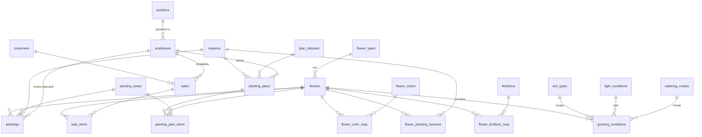
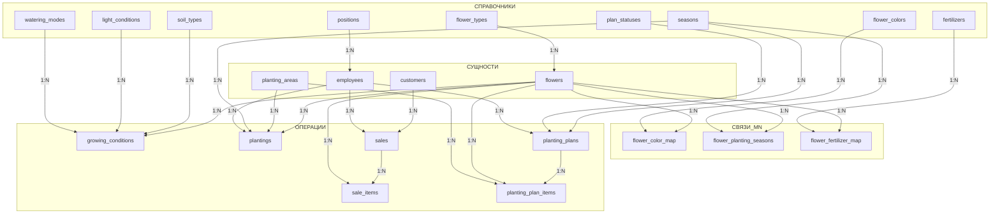
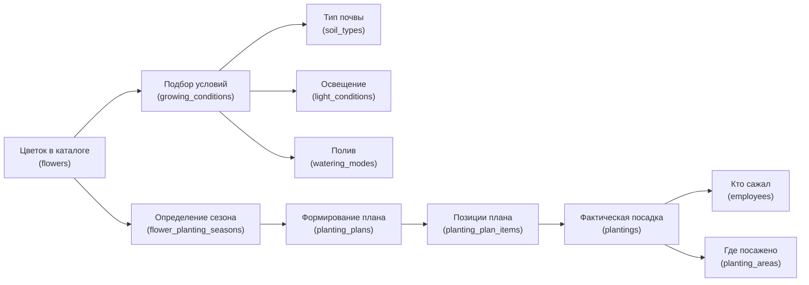
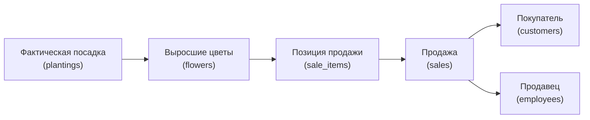
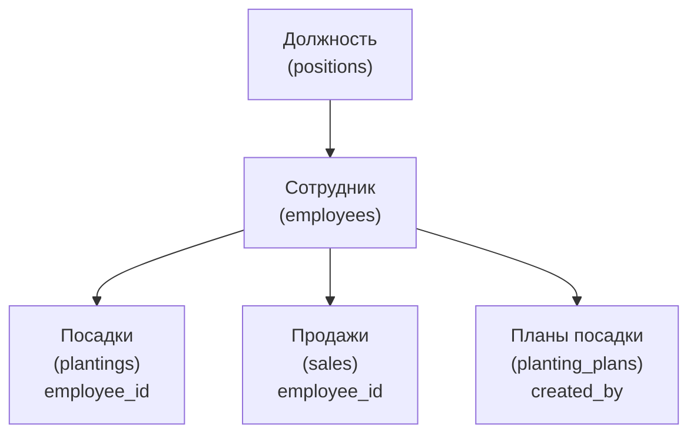

# БД «flower_farm» — Опытное хозяйство по выращиванию цветов

Единый файл: [database.sql](file:///c:/Users/ChePyX/Documents/antigravity/eager-borg/database.sql) — структура всех таблиц + начальные данные справочников.

---

## ER-диаграмма



---

## Состав БД — 20 таблиц

### Справочники (9 таблиц)

| # | Таблица | Назначение | Примеры |
|---|---------|------------|---------|
| 1 | `flower_types` | Тип цветка | Однолетние, Многолетние, Луковичные |
| 2 | `seasons` | Сезон | Весна, Лето, Осень, Зима |
| 3 | `soil_types` | Тип почвы | Чернозём, Суглинок, Песчаная |
| 4 | `light_conditions` | Освещение | Полное солнце, Полутень, Тень |
| 5 | `watering_modes` | Режим полива | Обильный, Умеренный, Редкий |
| 6 | `flower_colors` | Окраска | Красный, Белый, Жёлтый |
| 7 | `plan_statuses` | Статус плана | Черновик, Утверждён, Выполнен |
| 8 | `fertilizers` | Удобрения | Азотное, Фосфорное, Комплексное NPK |
| 9 | `positions` | Должности сотрудников | Агроном, Садовник, Менеджер |

### Основные сущности (5 таблиц)

| # | Таблица | Назначение |
|---|---------|------------|
| 10 | `planting_areas` | Участки (теплицы, грядки, поля) |
| 11 | `employees` | Сотрудники (ФИО, должность, телефон, дата найма) |
| 12 | `flowers` | Каталог цветов (название, тип, высота, период цветения) |
| 13 | `customers` | Покупатели |
| 14 | `growing_conditions` | Условия выращивания (почва, свет, полив, температура, влажность) |

### Связи M:N (3 таблицы)

| # | Таблица | Связь | Зачем |
|---|---------|-------|-------|
| 15 | `flower_color_map` | `flowers` ↔ `flower_colors` | У цветка несколько окрасок |
| 16 | `flower_planting_seasons` | `flowers` ↔ `seasons` | Цветок сажают в несколько сезонов |
| 17 | `flower_fertilizer_map` | `flowers` ↔ `fertilizers` | Цветку подходит несколько удобрений |

### Операционные таблицы (6 таблиц)

| # | Таблица | Назначение |
|---|---------|------------|
| 18 | `plantings` | Фактические посадки (цветок, участок, сезон, дата, кол-во, ответственный) |
| 19 | `sales` | Продажи — шапка (покупатель, продавец, дата, итого) |
| 20 | `sale_items` | Позиции продажи (цветок, количество, цена за единицу) |
| 21 | `planting_plans` | Планы посадки — шапка (сезон, дата, статус, автор) |
| 22 | `planting_plan_items` | Позиции плана (цветок, кол-во, участок) |

---

## Описание связей и взаимодействий

### Карта всех внешних ключей



### Связи 1:N (один-ко-многим)

| Родительская таблица | → | Дочерняя таблица | FK-столбец | Описание связи |
|---|---|---|---|---|
| `flower_types` | → | `flowers` | `flower_type_id` | Каждый цветок относится к одному типу. Один тип объединяет много цветов |
| `positions` | → | `employees` | `position_id` | У сотрудника одна должность. На одной должности может быть много сотрудников |
| `soil_types` | → | `growing_conditions` | `soil_type_id` | Условие выращивания предполагает один тип почвы |
| `light_conditions` | → | `growing_conditions` | `light_condition_id` | Условие выращивания предполагает один режим освещения |
| `watering_modes` | → | `growing_conditions` | `watering_mode_id` | Условие выращивания предполагает один режим полива |
| `flowers` | → | `growing_conditions` | `flower_id` | У цветка может быть набор условий выращивания |
| `flowers` | → | `plantings` | `flower_id` | Один цветок сажают многократно |
| `planting_areas` | → | `plantings` | `planting_area_id` | На одном участке проводят много посадок |
| `seasons` | → | `plantings` | `season_id` | В одном сезоне проводят много посадок |
| `employees` | → | `plantings` | `employee_id` | Один сотрудник может отвечать за много посадок |
| `customers` | → | `sales` | `customer_id` | Один покупатель может совершить много покупок |
| `employees` | → | `sales` | `employee_id` | Один сотрудник может оформить много продаж |
| `sales` | → | `sale_items` | `sale_id` | Одна продажа содержит много позиций (цветков) |
| `flowers` | → | `sale_items` | `flower_id` | Один цветок может фигурировать в позициях разных продаж |
| `seasons` | → | `planting_plans` | `season_id` | На один сезон может быть составлено несколько планов |
| `plan_statuses` | → | `planting_plans` | `plan_status_id` | Один статус может быть у многих планов |
| `employees` | → | `planting_plans` | `created_by` | Один сотрудник может составить много планов |
| `planting_plans` | → | `planting_plan_items` | `plan_id` | Один план содержит много позиций |
| `flowers` | → | `planting_plan_items` | `flower_id` | Один цветок может входить в позиции разных планов |
| `planting_areas` | → | `planting_plan_items` | `planting_area_id` | На один участок могут планироваться разные цветы |

### Связи M:N (многие-ко-многим)

Реализованы через промежуточные (связующие) таблицы с составным первичным ключом.

| Связь | Связующая таблица | PK | Доп. атрибуты | Как работает |
|---|---|---|---|---|
| `flowers` ↔ `flower_colors` | `flower_color_map` | `(flower_id, color_id)` | — | Роза может быть и красной, и белой. Белый цвет может быть у розы, лилии, хризантемы |
| `flowers` ↔ `seasons` | `flower_planting_seasons` | `(flower_id, season_id)` | `recommended_month_start`, `recommended_month_end` | Тюльпан сажают весной и осенью. Весной сажают тюльпаны, нарциссы, крокусы. Дополнительно хранятся рекомендуемые месяцы посадки внутри сезона |
| `flowers` ↔ `fertilizers` | `flower_fertilizer_map` | `(flower_id, fertilizer_id)` | `dosage_note` | Розе подходит и азотное, и комплексное NPK. Азотное удобрение подходит розам, лилиям, пионам. В `dosage_note` можно указать дозировку |

### Взаимодействие сущностей — потоки данных

#### Поток 1: От каталога к посадке



1. **Цветок** регистрируется в каталоге `flowers` с привязкой к типу из `flower_types`
2. Для цветка заполняются **условия выращивания** в `growing_conditions` — какая почва, свет, полив ему нужны (справочники `soil_types`, `light_conditions`, `watering_modes`)
3. Указываются **подходящие сезоны** посадки через `flower_planting_seasons` с рекомендуемыми месяцами
4. Указываются **подходящие удобрения** через `flower_fertilizer_map`
5. На основе этих данных формируется **план посадки** (`planting_plans` + `planting_plan_items`) — какие цветы, в каком количестве, на каком участке
6. Когда план утверждён (`plan_statuses`), создаётся запись **фактической посадки** в `plantings` с указанием ответственного сотрудника и участка

#### Поток 2: От посадки к продаже



1. После того как цветы выросли, они доступны для **продажи**
2. Продажа оформляется в `sales` (шапка: дата, покупатель из `customers`, продавец из `employees`)
3. Каждый проданный цветок — отдельная строка в `sale_items` (какой цветок, сколько штук, по какой цене)
4. Поле `total_amount` в `sales` — итоговая сумма чека

#### Поток 3: Роль сотрудников



Сотрудник (`employees`) участвует в трёх процессах:
- **Посадки** — ответственный за конкретную посадку (`plantings.employee_id`)
- **Продажи** — оформляет продажу покупателю (`sales.employee_id`)
- **Планирование** — составляет план посадки на сезон (`planting_plans.created_by`)

Должность сотрудника хранится в справочнике `positions` и подтягивается по `position_id`.

---

## Соответствие нормальным формам

| НФ | Что обеспечено |
|----|----------------|
| **1НФ** | Все атрибуты атомарны. Многозначные атрибуты (окраска, сезоны, удобрения) вынесены в связующие таблицы |
| **2НФ** | Неключевые атрибуты зависят от полного первичного ключа. В связующих таблицах нет частичных зависимостей |
| **3НФ** | Нет транзитивных зависимостей. Названия типов, должностей, статусов хранятся в справочниках — основные таблицы хранят только `id` |

---

## Поддержка будущих процедур

### Процедура 1 — Список цветов для посадки

> Автоматическое формирование по типу, сезону и количеству

```
flower_planting_seasons → flowers → flower_types
                        → seasons
Результат → planting_plans + planting_plan_items → planting_areas
```

### Процедура 2 — Отчёт о популярных цветах и продажах

> Агрегация продаж за период, ранжирование по популярности

```
sale_items → flowers → flower_types
           → sales (фильтр по sale_date)
                   → customers
                   → employees
```

---

## Что добавлено по сравнению с предыдущей версией

| Новое | Зачем |
|-------|-------|
| `employees` + `positions` | Учёт ответственных за посадки, продажи и планы |
| `fertilizers` + `flower_fertilizer_map` | Справочник удобрений с привязкой M:N к цветам |
| `employee_id` в `plantings`, `sales`, `planting_plans` | Кто посадил, кто продал, кто составил план |
