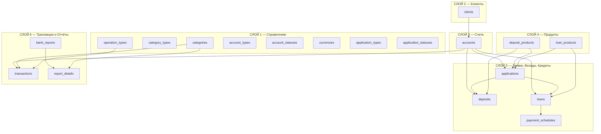
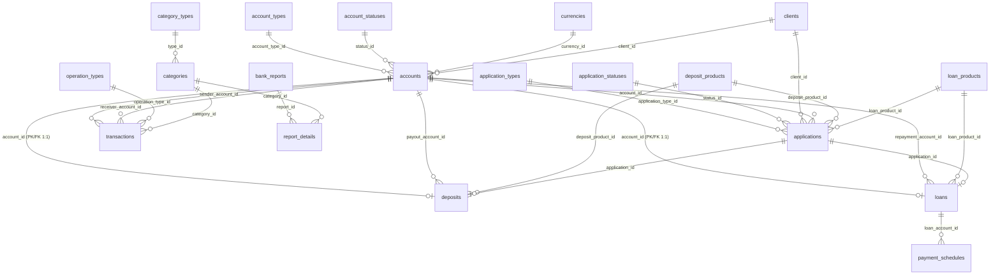
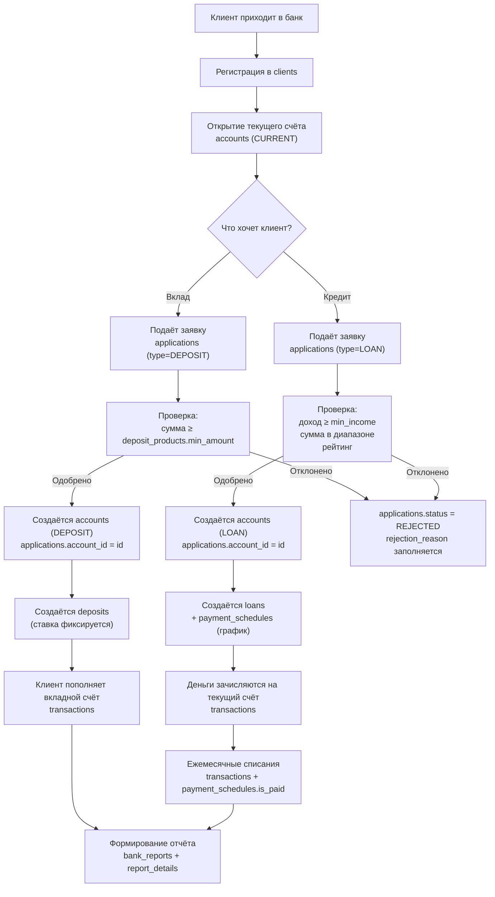

# Полное описание БД банка

## Общая архитектура

БД состоит из **18 таблиц**, организованных в **6 логических слоёв**:



---

## СЛОЙ 1 — Справочники (8 таблиц)

Справочники хранят фиксированные наборы значений. Ни одно поле в БД не хранит «магические строки» — всё через ID.

---

### `operation_types`

**Назначение:** типы банковских операций для транзакций.

| Поле | Тип | Описание |
|---|---|---|
| `id` | SERIAL PK | Первичный ключ |
| `name` | VARCHAR(100) | Название типа операции |

**Примеры данных:** Перевод, Пополнение, Снятие, Начисление процентов, Погашение кредита

**Кто ссылается:** `transactions.operation_type_id`

---

### `category_types`

**Назначение:** типы категорий — доход или расход. Справочник для таблицы `categories`.

| Поле | Тип | Описание |
|---|---|---|
| `id` | SERIAL PK | Первичный ключ |
| `name` | VARCHAR(10) | Тип категории |

**Примеры данных:** INCOME, EXPENSE

**Кто ссылается:** `categories.type_id`

---

### `categories`

**Назначение:** категории доходов и расходов банка (для транзакций и отчётов).

| Поле | Тип | Описание |
|---|---|---|
| `id` | SERIAL PK | Первичный ключ |
| `type_id` | INTEGER FK | Тип категории → `category_types.id` |
| `name` | VARCHAR(100) | Название категории |

**Примеры данных:**
| type_id | name |
|---|---|
| 1 (INCOME) | Процентный доход по кредитам |
| 1 (INCOME) | Комиссии |
| 2 (EXPENSE) | Процентные выплаты по вкладам |
| 2 (EXPENSE) | Операционные расходы |

**Кто ссылается:** `transactions.category_id`, `report_details.category_id`

---

### `account_types`

**Назначение:** типы банковских счетов.

| Поле | Тип | Описание |
|---|---|---|
| `id` | SERIAL PK | Первичный ключ |
| `name` | VARCHAR(20) | Тип счёта |

**Примеры данных:** CURRENT (текущий), DEPOSIT (вкладной), LOAN (кредитный)

**Кто ссылается:** `accounts.account_type_id`

---

### `account_statuses`

**Назначение:** статусы счетов.

| Поле | Тип | Описание |
|---|---|---|
| `id` | SERIAL PK | Первичный ключ |
| `name` | VARCHAR(20) | Статус |

**Примеры данных:** ACTIVE, CLOSED, FROZEN

**Кто ссылается:** `accounts.status_id`

---

### `currencies`

**Назначение:** валюты счетов.

| Поле | Тип | Описание |
|---|---|---|
| `id` | SERIAL PK | Первичный ключ |
| `code` | VARCHAR(3) UNIQUE | ISO-код валюты |
| `name` | VARCHAR(50) | Полное название |

**Примеры данных:** (RUB, Российский рубль), (USD, Доллар США), (EUR, Евро)

**Кто ссылается:** `accounts.currency_id`

---

### `application_types`

**Назначение:** типы заявок.

| Поле | Тип | Описание |
|---|---|---|
| `id` | SERIAL PK | Первичный ключ |
| `name` | VARCHAR(20) | Тип заявки |

**Примеры данных:** DEPOSIT (на вклад), LOAN (на кредит)

**Кто ссылается:** `applications.application_type_id`

---

### `application_statuses`

**Назначение:** статусы обработки заявок.

| Поле | Тип | Описание |
|---|---|---|
| `id` | SERIAL PK | Первичный ключ |
| `name` | VARCHAR(30) | Статус |

**Примеры данных:** NEW, APPROVED, REJECTED, CANCELLED

**Кто ссылается:** `applications.status_id`

---

## СЛОЙ 2 — Клиенты (1 таблица)

### `clients`

**Назначение:** физические лица — вкладчики и заёмщики банка.

| Поле | Тип | Описание |
|---|---|---|
| `id` | SERIAL PK | Первичный ключ |
| `first_name` | VARCHAR(50) | Имя |
| `last_name` | VARCHAR(50) | Фамилия |
| `middle_name` | VARCHAR(50) NULL | Отчество |
| `passport_data` | VARCHAR(20) UNIQUE | Серия и номер паспорта |
| `phone` | VARCHAR(20) NULL | Телефон |
| `monthly_income` | DECIMAL(15,2) | Ежемесячный доход (для оценки кредитоспособности) |
| `credit_rating` | INTEGER NULL | Кредитный рейтинг (баллы) |

**Ключи:** PK(`id`), UNIQUE(`passport_data`)

**Кто ссылается:** `accounts.client_id`, `applications.client_id`

> [!NOTE]
> `monthly_income` и `credit_rating` используются процедурой автоматической обработки кредитных заявок (пункт 1 ТЗ) для проверки платёжеспособности.

---

## СЛОЙ 3 — Счета (1 таблица)

### `accounts`

**Назначение:** **центральная таблица** БД. Все финансовые операции проходят через счета. Один клиент может иметь несколько счетов разных типов.

| Поле | Тип | Описание |
|---|---|---|
| `id` | SERIAL PK | Первичный ключ |
| `client_id` | INTEGER FK | Владелец → `clients.id` |
| `account_number` | VARCHAR(34) UNIQUE | Номер счёта (до 34 символов по стандарту IBAN) |
| `account_type_id` | INTEGER FK | Тип счёта → `account_types.id` |
| `balance` | DECIMAL(15,2) | Текущий остаток на счёте |
| `currency_id` | INTEGER FK | Валюта → `currencies.id` |
| `status_id` | INTEGER FK | Статус → `account_statuses.id` |
| `opened_at` | DATE | Дата открытия |

**Ключи:** PK(`id`), UNIQUE(`account_number`)

**Связи ОТ этой таблицы (FK в `accounts`):**
| FK | Куда | Тип связи | Смысл |
|---|---|---|---|
| `client_id` | `clients.id` | N:1 | У клиента много счетов |
| `account_type_id` | `account_types.id` | N:1 | Тип счёта из справочника |
| `currency_id` | `currencies.id` | N:1 | Валюта из справочника |
| `status_id` | `account_statuses.id` | N:1 | Статус из справочника |

**Связи К этой таблице (другие таблицы ссылаются на `accounts`):**
| Кто ссылается | Через поле | Тип связи | Смысл |
|---|---|---|---|
| `deposits` | `account_id` | 1:1 | Этот счёт **является** вкладом |
| `deposits` | `payout_account_id` | N:1 | Куда выплачивать проценты |
| `loans` | `account_id` | 1:1 | Этот счёт **является** кредитом |
| `loans` | `repayment_account_id` | N:1 | Откуда списывать платежи |
| `applications` | `account_id` | N:1 | Счёт, созданный по заявке |
| `transactions` | `sender_account_id` | N:1 | Счёт отправителя |
| `transactions` | `receiver_account_id` | N:1 | Счёт получателя |

**Пример: у клиента Иванова 4 счёта**
| id | account_number | account_type_id | balance |
|---|---|---|---|
| 1 | 40817810...001 | 1 (CURRENT) | 150 000.00 |
| 2 | 42305810...002 | 2 (DEPOSIT) | 500 000.00 |
| 3 | 42305810...003 | 2 (DEPOSIT) | 1 000 000.00 |
| 4 | 45506810...004 | 3 (LOAN) | −250 000.00 |

---

## СЛОЙ 4 — Продукты (2 таблицы)

Продукты — это «шаблоны», которые банк предлагает клиентам. Конкретный вклад или кредит создаётся на основе продукта.

---

### `deposit_products`

**Назначение:** каталог вкладных продуктов банка.

| Поле | Тип | Описание |
|---|---|---|
| `id` | SERIAL PK | Первичный ключ |
| `name` | VARCHAR(100) | Название продукта |
| `min_amount` | DECIMAL(15,2) | Минимальная сумма вклада |
| `interest_rate` | DECIMAL(5,2) | Базовая годовая ставка (%) |
| `term_months` | INTEGER | Срок вклада (месяцы) |

**Пример:** «Выгодный» — от 100 000 ₽, 12% годовых, 12 месяцев

**Кто ссылается:** `deposits.deposit_product_id`, `applications.deposit_product_id`

---

### `loan_products`

**Назначение:** каталог кредитных продуктов банка.

| Поле | Тип | Описание |
|---|---|---|
| `id` | SERIAL PK | Первичный ключ |
| `name` | VARCHAR(100) | Название продукта |
| `min_amount` | DECIMAL(15,2) | Минимальная сумма кредита |
| `max_amount` | DECIMAL(15,2) | Максимальная сумма кредита |
| `interest_rate` | DECIMAL(5,2) | Базовая годовая ставка (%) |
| `max_term_months` | INTEGER | Максимальный срок (месяцы) |
| `min_income` | DECIMAL(15,2) | Минимальный доход заёмщика |

**Пример:** «Потребительский» — от 50 000 до 1 000 000 ₽, 18% годовых, до 60 месяцев, доход от 30 000 ₽

**Кто ссылается:** `loans.loan_product_id`, `applications.loan_product_id`

> [!NOTE]
> `min_income` используется процедурой обработки заявок: если `clients.monthly_income < loan_products.min_income`, заявка автоматически отклоняется.

---

## СЛОЙ 5 — Заявки, Вклады, Кредиты (4 таблицы)

---

### `applications`

**Назначение:** единая таблица заявок на вклады и кредиты. Точка входа клиента: подача заявки → обработка → открытие счёта.

| Поле | Тип | Описание |
|---|---|---|
| `id` | SERIAL PK | Первичный ключ |
| `client_id` | INTEGER FK | Клиент-заявитель → `clients.id` |
| `application_type_id` | INTEGER FK | Тип заявки → `application_types.id` |
| `deposit_product_id` | INTEGER FK NULL | Вкладной продукт → `deposit_products.id` |
| `loan_product_id` | INTEGER FK NULL | Кредитный продукт → `loan_products.id` |
| `requested_amount` | DECIMAL(15,2) | Запрашиваемая сумма |
| `requested_term_months` | INTEGER | Запрашиваемый срок (месяцы) |
| `status_id` | INTEGER FK | Статус заявки → `application_statuses.id` |
| `rejection_reason` | TEXT NULL | Причина отказа (при отклонении) |
| `applied_at` | TIMESTAMPTZ | Дата подачи |
| `processed_at` | TIMESTAMPTZ NULL | Дата обработки |
| `account_id` | INTEGER FK NULL | Созданный счёт → `accounts.id` |

**Полиморфная логика:**
- Если `application_type_id` = DEPOSIT → заполнен `deposit_product_id`, а `loan_product_id` = NULL
- Если `application_type_id` = LOAN → заполнен `loan_product_id`, а `deposit_product_id` = NULL

**Жизненный цикл заявки:**
```
NEW → APPROVED → (создаётся счёт, account_id заполняется)
NEW → REJECTED → (rejection_reason заполняется)
NEW → CANCELLED
```

**Кто ссылается:** `deposits.application_id`, `loans.application_id`

---

### `deposits`

**Назначение:** детализация вкладного счёта. Расширяет `accounts` с `account_type_id` = DEPOSIT. Связь 1:1 — один счёт = один вклад.

| Поле | Тип | Описание |
|---|---|---|
| `account_id` | INTEGER PK, FK | Вкладной счёт → `accounts.id` |
| `application_id` | INTEGER FK NULL, UNIQUE | Заявка-источник → `applications.id` |
| `deposit_product_id` | INTEGER FK | Продукт вклада → `deposit_products.id` |
| `interest_rate` | DECIMAL(5,2) | Зафиксированная ставка на момент открытия |
| `start_date` | DATE | Дата начала вклада |
| `end_date` | DATE | Дата окончания вклада |
| `payout_account_id` | INTEGER FK NULL | Куда выплачивать проценты → `accounts.id` |

**Ключи:** PK(`account_id`), UNIQUE(`application_id`)

> [!IMPORTANT]
> `account_id` является одновременно PK и FK → `accounts.id`. Это паттерн **Table-per-Type**: запись в `deposits` **расширяет** запись в `accounts`. Связь строго 1:1.

**Зачем `interest_rate` дублируется из `deposit_products`?**
Ставка фиксируется на момент открытия вклада. Если банк изменит ставку продукта, уже открытые вклады сохранят свою ставку. Это **снимок** (snapshot), а не дублирование.

**Зачем `payout_account_id`?**
Это **другой** счёт клиента (обычно CURRENT), куда банк перечисляет проценты. Например: вклад на счёте №2, проценты капают на счёт №1 (текущий).

---

### `loans`

**Назначение:** детализация кредитного счёта. Расширяет `accounts` с `account_type_id` = LOAN. Связь 1:1.

| Поле | Тип | Описание |
|---|---|---|
| `account_id` | INTEGER PK, FK | Кредитный счёт → `accounts.id` |
| `application_id` | INTEGER FK NULL, UNIQUE | Заявка-источник → `applications.id` |
| `loan_product_id` | INTEGER FK | Продукт кредита → `loan_products.id` |
| `repayment_account_id` | INTEGER FK | Откуда списывать платежи → `accounts.id` |
| `principal_amount` | DECIMAL(15,2) | Сумма основного долга (тело кредита) |
| `interest_rate` | DECIMAL(5,2) | Зафиксированная ставка |
| `start_date` | DATE | Дата выдачи кредита |
| `end_date` | DATE | Дата окончания кредита |

**Ключи:** PK(`account_id`), UNIQUE(`application_id`)

**Зачем `repayment_account_id`?**
Это текущий счёт клиента, с которого банк ежемесячно списывает платёж по кредиту. Например: кредит на счёте №4, платежи списываются со счёта №1 (текущий).

---

### `payment_schedules`

**Назначение:** график ежемесячных платежей по кредиту. Создаётся при выдаче кредита, обновляется при каждом платеже.

| Поле | Тип | Описание |
|---|---|---|
| `id` | BIGSERIAL PK | Первичный ключ |
| `loan_account_id` | INTEGER FK | Кредит → `loans.account_id` |
| `payment_date` | DATE | Плановая дата платежа |
| `principal_debt` | DECIMAL(15,2) | Часть платежа на погашение тела долга |
| `accrued_interest` | DECIMAL(15,2) | Часть платежа на погашение процентов |
| `total_payment` | DECIMAL(15,2) | Итого к оплате |
| `is_paid` | BOOLEAN | Оплачен ли |
| `actual_payment_date` | DATE NULL | Фактическая дата оплаты |

**Пример: кредит на 12 месяцев → 12 строк в `payment_schedules`**
| payment_date | principal_debt | accrued_interest | total_payment | is_paid |
|---|---|---|---|---|
| 2026-02-15 | 18 000.00 | 3 750.00 | 21 750.00 | TRUE |
| 2026-03-15 | 18 270.00 | 3 480.00 | 21 750.00 | TRUE |
| 2026-04-15 | 18 544.00 | 3 206.00 | 21 750.00 | FALSE |
| ... | ... | ... | ... | ... |

---

## СЛОЙ 6 — Транзакции и Отчёты (3 таблицы)

---

### `transactions`

**Назначение:** все финансовые операции банка. Каждое движение денег — это транзакция.

| Поле | Тип | Описание |
|---|---|---|
| `id` | BIGSERIAL PK | Первичный ключ |
| `sender_account_id` | INTEGER FK NULL | Счёт отправителя → `accounts.id` |
| `receiver_account_id` | INTEGER FK NULL | Счёт получателя → `accounts.id` |
| `operation_type_id` | INTEGER FK | Тип операции → `operation_types.id` |
| `category_id` | INTEGER FK NULL | Категория → `categories.id` |
| `amount` | DECIMAL(15,2) | Сумма операции |
| `created_at` | TIMESTAMPTZ | Дата и время операции |
| `description` | TEXT NULL | Описание / комментарий |

**Почему `sender` и `receiver` могут быть NULL?**
| Ситуация | sender | receiver |
|---|---|---|
| Перевод между счетами | Счёт А | Счёт Б |
| Внесение наличных | NULL | Счёт А |
| Снятие наличных | Счёт А | NULL |
| Начисление процентов по вкладу | NULL | Вкладной счёт |
| Списание платежа по кредиту | Текущий счёт | Кредитный счёт |

---

### `bank_reports`

**Назначение:** шапка отчёта о доходности банка за период (пункт 2 ТЗ).

| Поле | Тип | Описание |
|---|---|---|
| `id` | SERIAL PK | Первичный ключ |
| `report_name` | VARCHAR(150) | Название отчёта |
| `period_start` | DATE | Начало периода |
| `period_end` | DATE | Конец периода |
| `total_income` | DECIMAL(15,2) | Итого доходы |
| `total_expense` | DECIMAL(15,2) | Итого расходы |
| `net_profit` | DECIMAL(15,2) | Чистая прибыль |
| `created_at` | TIMESTAMPTZ | Дата формирования |

**Кто ссылается:** `report_details.report_id`

---

### `report_details`

**Назначение:** строки детализации отчёта — разбивка по категориям.

| Поле | Тип | Описание |
|---|---|---|
| `id` | BIGSERIAL PK | Первичный ключ |
| `report_id` | INTEGER FK | Отчёт → `bank_reports.id` |
| `category_id` | INTEGER FK | Категория → `categories.id` |
| `amount` | DECIMAL(15,2) | Сумма по категории |

**Пример: отчёт за сентябрь 2026**
| category_id | amount |
|---|---|
| 1 (Процентный доход по кредитам) | 2 500 000.00 |
| 2 (Комиссии) | 350 000.00 |
| 3 (Процентные выплаты по вкладам) | −1 800 000.00 |
| 4 (Операционные расходы) | −400 000.00 |

---

## Полная карта всех связей (24 FK)



## Сводная таблица всех FK

| # | Таблица | Поле (FK) | → Ссылается на | Тип связи | Обязательность |
|---|---|---|---|---|---|
| 1 | `categories` | `type_id` | `category_types.id` | N:1 | NOT NULL |
| 2 | `accounts` | `client_id` | `clients.id` | N:1 | NOT NULL |
| 3 | `accounts` | `account_type_id` | `account_types.id` | N:1 | NOT NULL |
| 4 | `accounts` | `currency_id` | `currencies.id` | N:1 | NOT NULL |
| 5 | `accounts` | `status_id` | `account_statuses.id` | N:1 | NOT NULL |
| 6 | `applications` | `client_id` | `clients.id` | N:1 | NOT NULL |
| 7 | `applications` | `application_type_id` | `application_types.id` | N:1 | NOT NULL |
| 8 | `applications` | `deposit_product_id` | `deposit_products.id` | N:1 | NULL |
| 9 | `applications` | `loan_product_id` | `loan_products.id` | N:1 | NULL |
| 10 | `applications` | `status_id` | `application_statuses.id` | N:1 | NOT NULL |
| 11 | `applications` | `account_id` | `accounts.id` | N:1 | NULL |
| 12 | `deposits` | `account_id` | `accounts.id` | 1:1 | NOT NULL (PK) |
| 13 | `deposits` | `application_id` | `applications.id` | 1:1 | NULL (UNIQUE) |
| 14 | `deposits` | `deposit_product_id` | `deposit_products.id` | N:1 | NOT NULL |
| 15 | `deposits` | `payout_account_id` | `accounts.id` | N:1 | NULL |
| 16 | `loans` | `account_id` | `accounts.id` | 1:1 | NOT NULL (PK) |
| 17 | `loans` | `application_id` | `applications.id` | 1:1 | NULL (UNIQUE) |
| 18 | `loans` | `loan_product_id` | `loan_products.id` | N:1 | NOT NULL |
| 19 | `loans` | `repayment_account_id` | `accounts.id` | N:1 | NOT NULL |
| 20 | `payment_schedules` | `loan_account_id` | `loans.account_id` | N:1 | NOT NULL |
| 21 | `transactions` | `sender_account_id` | `accounts.id` | N:1 | NULL |
| 22 | `transactions` | `receiver_account_id` | `accounts.id` | N:1 | NULL |
| 23 | `transactions` | `operation_type_id` | `operation_types.id` | N:1 | NOT NULL |
| 24 | `transactions` | `category_id` | `categories.id` | N:1 | NULL |
| 25 | `report_details` | `report_id` | `bank_reports.id` | N:1 | NOT NULL |
| 26 | `report_details` | `category_id` | `categories.id` | N:1 | NOT NULL |

---

## Бизнес-процесс целиком


